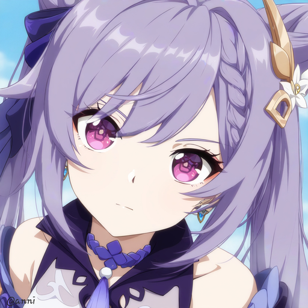
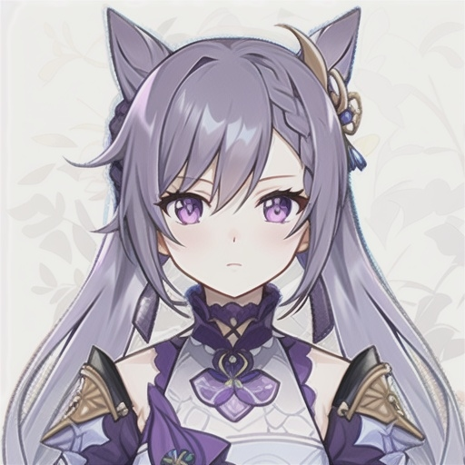

<div align="center">

# LoRA微调Stable Diffusion 1.5的技术文档

</div>   
 
## 一、项目背景
</p>在学习完VAE、DDPM已经LDM后需要把他们落实到代码上，而且用LoRA微调是模型微调的基本功，所以在这里我来学习一下经典的LoRA微调。</p>

## 二、环境依赖

</p>只需要在终端输入这行指令即可</p>

```bash
pip install -r requirements.txt
```
## 三、结果展示
## 📊 训练数据集示例
我先展示一下我的一部分训练集的图像，而且每个图像还会给对应的keqing_02.txt提示词
<p align="center">
  
  
</p>
因为我的电脑配置很一般(NVIDIA GeForce RTX 3050 Laptop GPU)，显存只有4G，所以生成的图像质量平均质量一般。
接下来我会展现用了lora微调生成的图像和用了lora微调生成的图像
### 有无Lora微调对比
<p align="center">
  
  <br>
  <strong>无Lora</strong>
</p>
<p align="center">
  
  <br>
  <strong>有Lora</strong>
</p>
